# MyNote

MyNote e uma aplicacao web e PWA para organizar rotinas, tarefas, lembretes, eventos de calendario e notificacoes. O projeto foi desenvolvido como um app de produtividade pessoal simples, visual e rapido de usar, com foco em criar compromissos e receber avisos sem precisar passar muito tempo dentro da aplicacao.

O sistema possui frontend em HTML, CSS e JavaScript puro, backend em Node.js com Express, banco MySQL, autenticacao por JWT e suporte a notificacoes push para desktop e mobile.

## Visao geral

- Gerenciamento de rotinas personalizadas.
- Modelos prontos para diferentes tipos de rotina.
- Tarefas com horario, status, notificacao, alarme e conclusao.
- Lembretes independentes com prioridade, data, horario, notificacao e alarme.
- Calendario mensal e anual com eventos, feriados e datas comemorativas.
- Interface adaptada para computador e celular.
- Instalacao como app mobile via PWA.
- Tutorial inicial e personalizacao no primeiro acesso.
- Configuracoes de tema, notificacoes, privacidade, backup e produtividade.

## Funcionalidades

### Autenticacao e conta

- Login com Google.
- Login com e-mail e senha.
- Cadastro de novos usuarios.
- Recuperacao de senha por e-mail.
- Autenticacao com JWT.
- Dados separados por usuario.
- Protecao de rotas no backend.

### Dashboard

- Tela principal com lista de rotinas.
- Layout responsivo para desktop e mobile.
- No mobile, as abas abrem em tela cheia conforme o usuario toca em cada item.
- Botao de voltar nas abas mobile para retornar a lista de rotinas.
- Botao flutuante para acessar rapidamente o calendario e criar novos itens.
- Animacoes leves em botoes, cards, transicoes e conclusao de tarefas.

### Rotinas

- Criacao de rotinas personalizadas.
- Edicao e exclusao de rotinas.
- Reordenacao de rotinas por arrastar e soltar.
- Notas individuais por rotina, salvas mesmo apos sair do site.
- Menu de tres pontos para acoes rapidas.
- Personalizacao dos campos das tabelas de rotina.

### Modelos de rotina

O MyNote possui modelos prontos para acelerar a criacao:

- Diaria: tarefas simples por horario.
- Estudos: provas, atividades, disciplina, horario e material.
- Trabalho: projetos, prioridade, prazo e status.
- Alimentacao: refeicoes, horario, calorias e notificacao.
- Semanal: quadro por dias da semana.
- Treino: cards por dia com grupo muscular, series, repeticoes e carga.
- Personalizada: tabela livre com os campos escolhidos pelo usuario.

### Tarefas

- Criacao, edicao e exclusao de tarefas.
- Status de tarefa: pendente e concluida.
- Marcacao de tarefa concluida com animacao visual.
- Ao desmarcar uma tarefa concluida, ela volta para pendente.
- Notificacoes por tarefa.
- Alarme por tarefa, configuravel no modal de criacao e no menu de frequencia.
- Controle de antecedencia do aviso.
- Repeticao ou prazo, dependendo do tipo de tarefa.
- Tarefas concluidas antes do horario nao disparam aviso nem alarme.
- Organizacao por rotina, horario, status, prioridade e campos especificos.

### Rotina semanal

- Visualizacao em colunas por dia da semana.
- Contador de tarefas concluidas por dia.
- Cards compactos para nao prejudicar o espaco no mobile.
- Edicao rapida pelo botao de lapis.
- Conclusao com animacao leve.
- Notas da rotina abaixo do quadro semanal.

### Rotina de treino

- Cards de exercicio por dia da semana.
- Informacoes de grupo muscular, series, repeticoes, carga e status.
- Botao visual de conclusao do treino.
- Marcacao concluida com animacao.
- Botao de descanso por dia.
- Layout ajustado para mobile para evitar sobreposicao entre cards e botoes.

### Lembretes

- Criacao de lembretes com titulo, horario, dia/mes e prioridade.
- Edicao e exclusao de lembretes.
- Notificacao por lembrete.
- Alarme por lembrete, configuravel no modal.
- Suporte a lembretes com data especifica ou recorrentes.
- Menu de acoes adaptado para desktop e mobile.

### Calendario

- Calendario mensal com eventos, tarefas e lembretes.
- Visualizacao anual com todos os meses.
- Navegacao entre meses e anos.
- Eventos com titulo, horario, data, prioridade e tipo.
- Eventos de aniversario configurados como permanentes.
- Feriados e datas comemorativas exibidos no calendario.
- Ajustes de layout mobile para ocupar melhor a largura da tela.
- Eventos com antecedencia de aviso.
- Para eventos com horario, o aviso antecipado e uma notificacao e o horario exato pode disparar alarme.

### Notificacoes e alarmes

- Notificacoes no navegador.
- Push notifications via Service Worker.
- Cadastro de inscricao push no backend.
- Scheduler no backend para verificar tarefas, lembretes e eventos.
- Opcao global para comportamento de notificacao/alarme.
- Opcao individual de alarme em tarefas e lembretes.
- Controle de antecedencia do aviso.
- Acoes na notificacao para tarefas, como "Vou fazer" e "Ja fiz".
- A acao "Ja fiz" conclui a tarefa automaticamente.
- Notificacoes duplicadas sao reduzidas por identificadores de tarefa/lembrete.
- Som de alarme personalizado em arquivo local.

Observacao: por limitacao dos navegadores/PWA, alarmes em tela cheia iguais ao app nativo de relogio do celular dependem de recursos nativos do sistema operacional. O MyNote usa o maximo disponivel no navegador: push, service worker, som, vibracao, notificacao persistente e acoes.

### App mobile e PWA

- Manifest configurado para instalacao como app.
- Icones 192x192 e 512x512.
- Service Worker com cache dos arquivos principais.
- Tela inicial em modo standalone.
- Interface mobile com navegacao por abas.
- Calendario, lembretes, configuracoes e rotinas adaptados para celular.

### Tutorial inicial

- Modal de boas-vindas para novos usuarios.
- Primeiros passos do dashboard.
- Etapa extra explicando:
  - menu de tres pontos;
  - notas das rotinas;
  - configuracoes do site;
  - notificacoes e alarmes;
  - arrastar e segurar rotinas no celular para trocar a ordem.
- Fluxo para pular tutorial ou seguir para personalizacao.

### Personalizacao e configuracoes

- Personalizacao inicial do dashboard.
- Tema claro e escuro.
- Paletas de fundo.
- Cor de destaque.
- Tamanho da fonte.
- Configuracoes de notificacoes.
- Troca do som das notificacoes/alarmes.
- Preferencias de produtividade.
- Privacidade.
- Backup e restauracao de dados.
- Exportacao de estatisticas em PDF ou Excel.

### Sincronizacao de dados

- Rotinas, tarefas, lembretes, eventos e configuracoes sao salvos no backend.
- O mesmo usuario pode acessar pelo computador ou celular.
- As alteracoes feitas em um dispositivo sao persistidas no banco e podem aparecer no outro ao atualizar/recarregar os dados.

## Tecnologias

### Frontend

- HTML5
- CSS3
- JavaScript
- PWA
- Service Worker
- Web Notifications API
- Push API

### Backend

- Node.js
- Express
- MySQL
- JWT
- Google Auth
- Nodemailer
- node-cron
- web-push

### Banco e infraestrutura

- MySQL
- Variaveis de ambiente com dotenv
- Deploy frontend em hospedagem estatica
- Deploy backend como API Node.js

## Screenshots

### Login

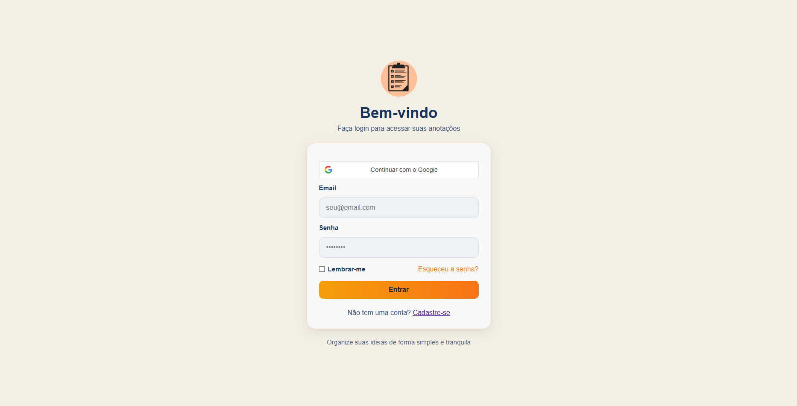

### Customizacao inicial

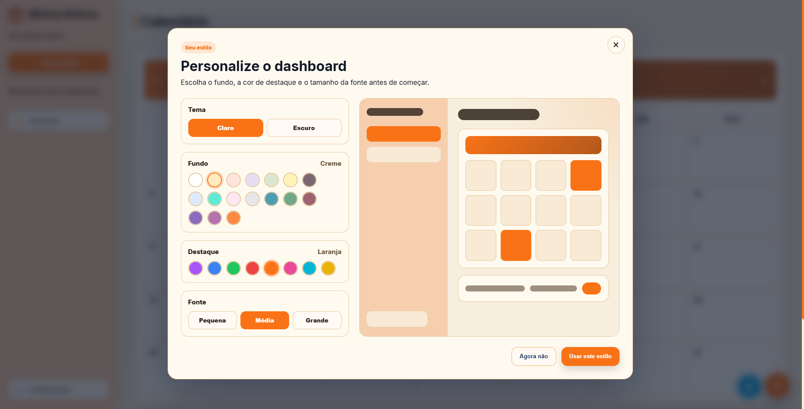

### Dashboard

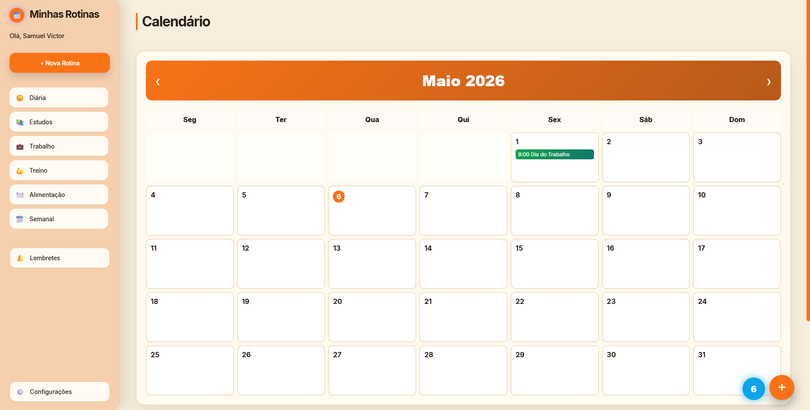

### Criar rotina

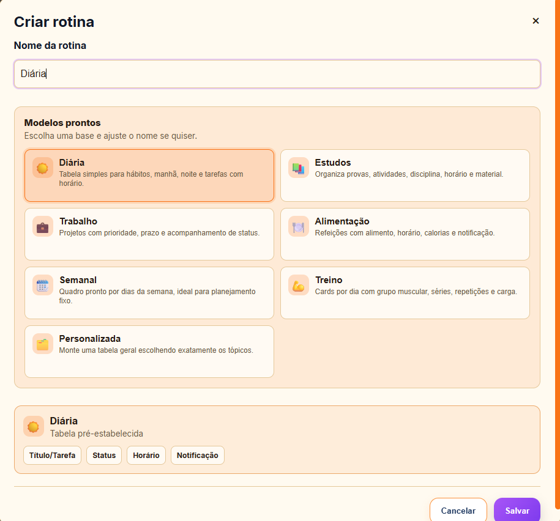

### Rotina diaria

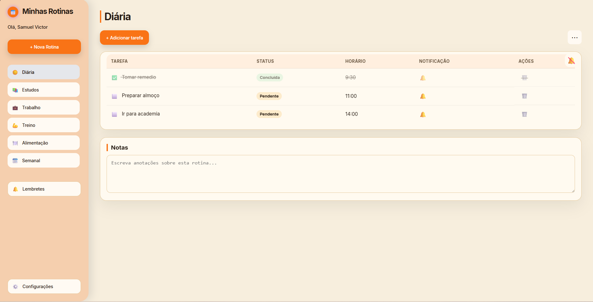

### Rotina treino

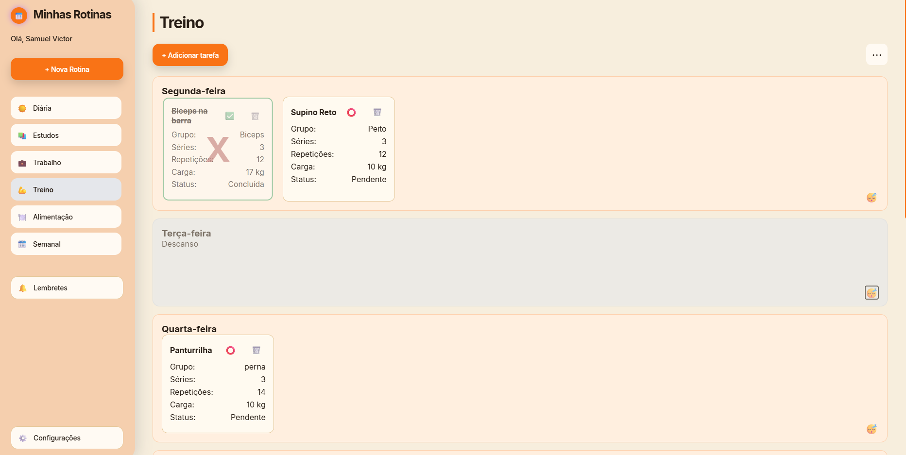

### Rotina semanal

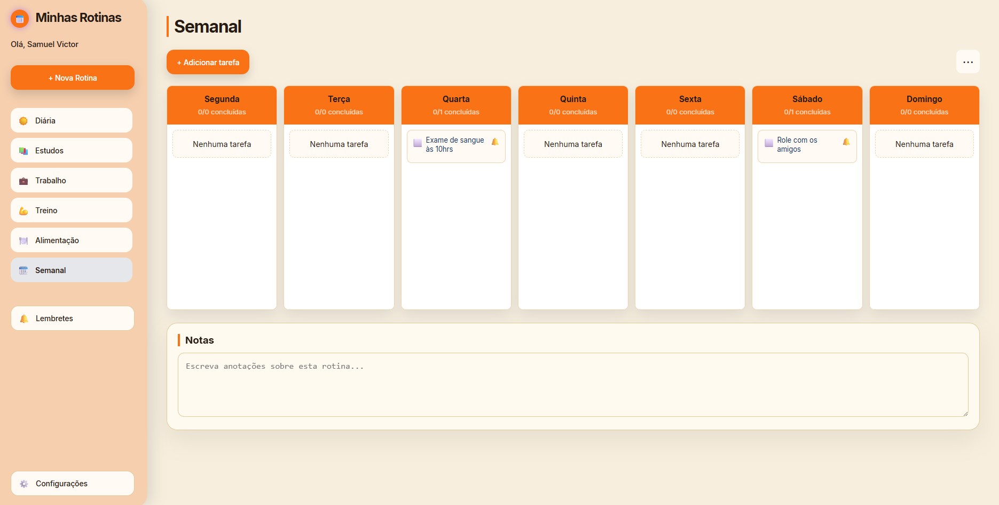

### Configuracoes

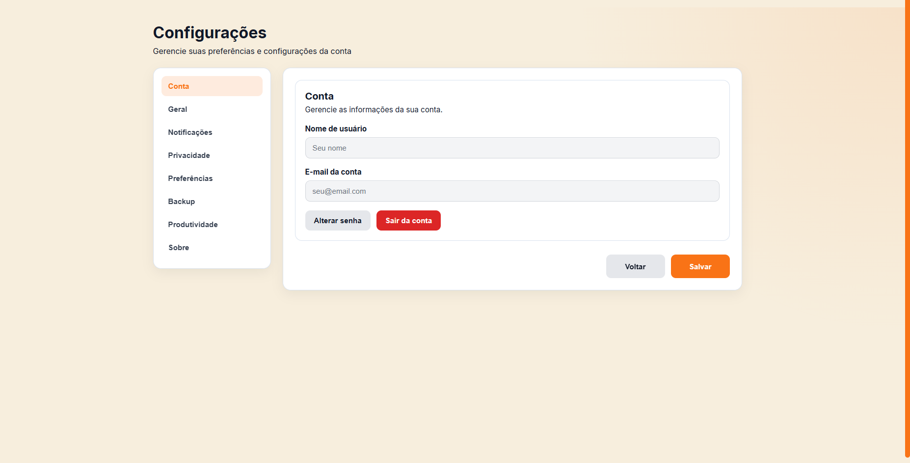

### App mobile

O MyNote tambem pode ser usado como app instalado no celular. No mobile, a tela inicial mostra as rotinas e cada aba abre em tela cheia, com botao de voltar para retornar ao inicio.

| Rotinas | Calendario | Lembretes |
|---|---|---|
| 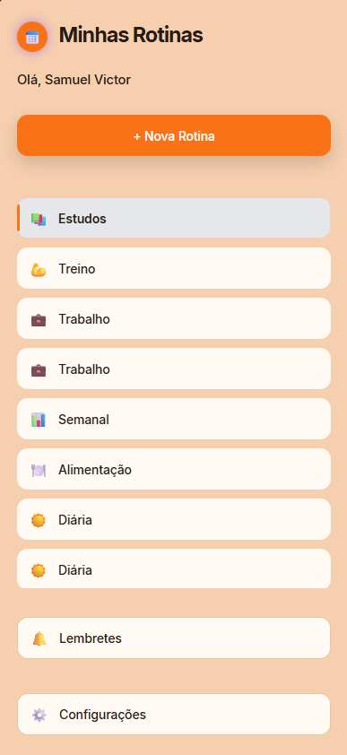 | 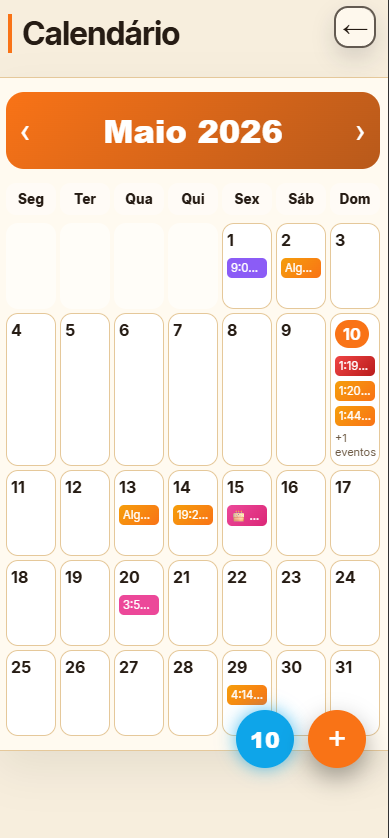 | 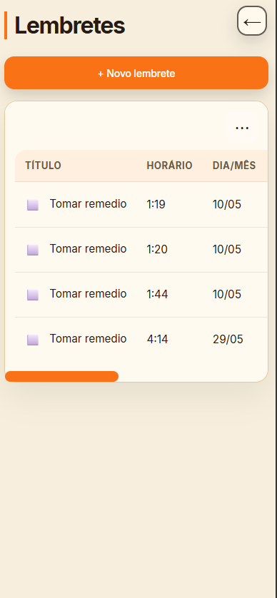 |

| Nova tarefa | Criar rotina | Frequencia |
|---|---|---|
| 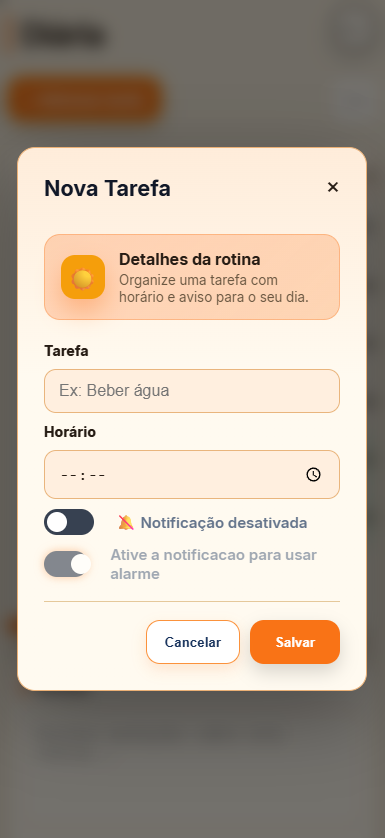 | 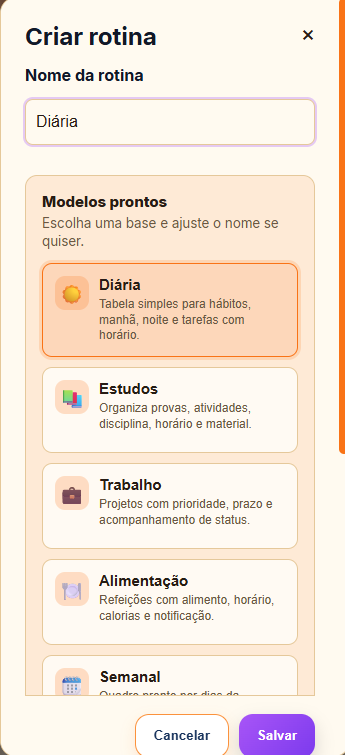 | 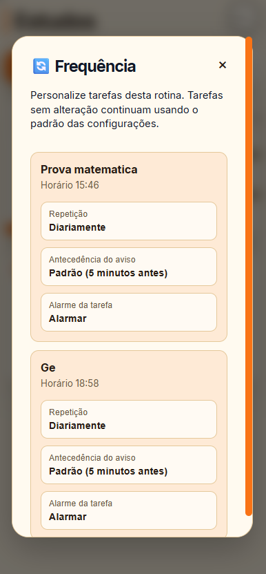 |

## Estrutura do projeto

```txt
MyNote-app/
|-- backend/
|   |-- config/
|   |   `-- db.js
|   |-- controllers/
|   |   |-- authController.js
|   |   |-- configuracaoController.js
|   |   |-- eventoCalendarioController.js
|   |   |-- lembreteController.js
|   |   |-- pushController.js
|   |   |-- rotinaController.js
|   |   `-- tarefaController.js
|   |-- middlewares/
|   |   `-- authMiddleware.js
|   |-- routes/
|   |   |-- authRoutes.js
|   |   |-- configuracaoRoutes.js
|   |   |-- eventoCalendarioRoutes.js
|   |   |-- lembreteRoutes.js
|   |   |-- pushRoutes.js
|   |   |-- rotinaRoutes.js
|   |   `-- tarefaRoutes.js
|   |-- services/
|   |   |-- notificacaoScheduler.js
|   |   `-- pushService.js
|   |-- utils/
|   |-- package.json
|   |-- testPush.js
|   `-- server.js
|
|-- frontend/
|   |-- assets/
|   |   |-- screenshots/
|   |   |-- alarme-suave.wav
|   |   |-- notificacao.wav
|   |   |-- icon-192.png
|   |   |-- icon-512.png
|   |   |-- favicon.png
|   |   `-- logo.png
|   |-- css/
|   |   |-- base/
|   |   |-- components/
|   |   |-- features/
|   |   |-- pages/
|   |   |-- responsive/
|   |   `-- style.css
|   |-- js/
|   |   |-- api.js
|   |   |-- app-preferences.js
|   |   |-- cadastro.js
|   |   |-- configuracoes.js
|   |   |-- dashboard.js
|   |   |-- esqueci.js
|   |   |-- login.js
|   |   |-- reset.js
|   |   `-- script.js
|   |-- cadastro.html
|   |-- configuracoes.html
|   |-- dashboard.html
|   |-- esqueci.html
|   |-- index.html
|   |-- manifest.json
|   |-- reset.html
|   `-- service-worker.js
|
|-- package.json
|-- package-lock.json
|-- .gitignore
`-- README.md
```

## Arquitetura

### Frontend

O frontend e responsavel por:

- renderizar o dashboard;
- controlar modais de rotina, tarefa, lembrete e calendario;
- aplicar preferencias visuais do usuario;
- registrar o Service Worker;
- solicitar permissao de notificacao;
- cadastrar a inscricao push no backend;
- consumir a API protegida com JWT.

### Backend

O backend e responsavel por:

- autenticar usuarios;
- proteger rotas;
- salvar dados por usuario;
- gerenciar rotinas, tarefas, lembretes, eventos e configuracoes;
- armazenar inscricoes push;
- executar o scheduler de notificacoes;
- enviar notificacoes push usando VAPID.

## Rotas principais da API

```txt
/auth
/rotinas
/tarefas
/lembretes
/configuracoes
/eventos-calendario
/push
```

## Variaveis de ambiente

O backend usa variaveis sensiveis em `.env`.

```env
PORT=3000

DB_HOST=
DB_PORT=3306
DB_USER=
DB_PASSWORD=
DB_NAME=

JWT_SECRET=

GOOGLE_CLIENT_ID=

EMAIL_USER=
EMAIL_PASS=
FRONTEND_URL=

VAPID_EMAIL=
VAPID_PUBLIC_KEY=
VAPID_PRIVATE_KEY=
```

## Como rodar localmente

### 1. Instalar dependencias

```bash
npm install
cd backend
npm install
```

### 2. Configurar o backend

Crie o arquivo `backend/.env` com as variaveis necessarias para banco, JWT, Google Auth, e-mail e VAPID.

### 3. Iniciar o backend

```bash
cd backend
npm run dev
```

ou:

```bash
cd backend
npm start
```

### 4. Abrir o frontend

Abra o `frontend/index.html` ou sirva a pasta `frontend` com um servidor estatico local.

Exemplo:

```bash
npx serve frontend
```

## O que ainda pode ser adicionado

- Sincronizacao em tempo real com WebSocket ou Server-Sent Events.
- Modo offline mais completo com fila de sincronizacao.
- App nativo ou hibrido para alarmes em tela cheia no estilo relogio do celular.
- Historico de conclusoes por tarefa.
- Estatisticas avancadas por rotina, semana e mes.
- Filtros e busca global.
- Tags ou categorias extras.
- Subtarefas.
- Importacao e exportacao de calendario no formato `.ics`.
- Compartilhamento de rotinas entre usuarios.
- Anexos em tarefas e lembretes.
- Widgets para tela inicial do celular.
- Pomodoro ou temporizador de foco.
- Testes automatizados no frontend e backend.
- Documentacao da API com OpenAPI/Swagger.
- Pipeline de CI/CD.
- Logs e monitoramento de erros em producao.

## Status do projeto

Projeto em evolucao ativa. As principais bases do app ja estao implementadas: autenticacao, rotinas, tarefas, calendario, lembretes, configuracoes, PWA, notificacoes push, alarmes e responsividade mobile.
